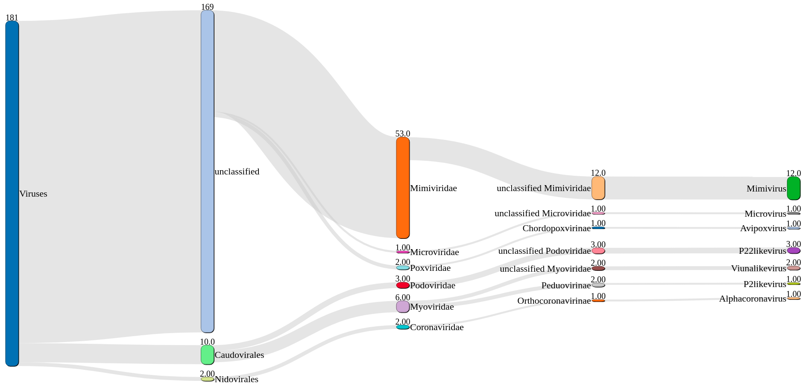
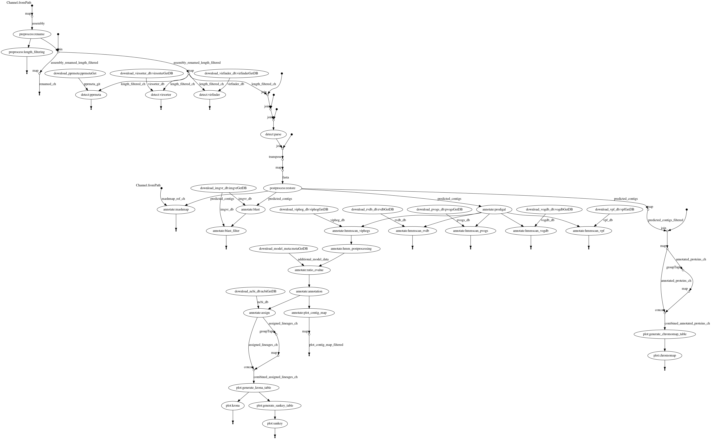

1. [ VIRify pipeline ](#virify)
2. [ CWL execution ](#cwl)
3. [ Nextflow execution ](#nf)

<a name="virify"></a>

# VIRify

VIRify is a recently developed pipeline for the detection, annotation, and taxonomic classification of viral contigs in metagenomic and metatranscriptomic assemblies. The pipeline is part of the repertoire of analysis services offered by [MGnify](https://www.ebi.ac.uk/metagenomics/). VIRify’s taxonomic classification relies on the detection of taxon-specific profile hidden Markov models (HMMs), built upon a set of 22,014 orthologous protein domains and referred to as ViPhOGs. 

<a name="cwl"></a>

# CWL

TODO ...

<a name="nf"></a>

# Nextflow
Email: hoelzer.martin@gmail.com

A nextflow implementation of the VIRify pipeline for the detection of viruses from metagenomic assemblies. The same scripts are used in the CWL and Nextflow implementation. 

## What do I need?

This pipeline runs with the workflow manager [Nextflow](https://www.nextflow.io/) using [Docker](https://docs.docker.com/v17.09/engine/installation/linux/docker-ce/ubuntu/#install-docker-ce) (Conda will be implemented soonish, hopefully). All other programs and databases are automatically downloaded by Nextflow. _Attention_, the workflow will download databases with a size of roughly 49 GB the first time it is executed. 

### Install Nextflow
```bash
curl -s https://get.nextflow.io | bash
```
* see [more instructions about Nextflow](https://www.nextflow.io/). 

### Install Docker
If you dont have experience with bioinformatic tools and their installation just copy the commands into your terminal to set everything up:
```bash
sudo apt-get install -y docker-ce docker-ce-cli containerd.io
sudo usermod -a -G docker $USER
```
* restart your computer
* see [more instructions about Docker](https://docs.docker.com/v17.09/engine/installation/linux/docker-ce/ubuntu/#install-docker-ce)


## Basic execution

Simply clone this repository or get or update the workflow via Nextflow:
```bash
nextflow pull EBI-Metagenomics/emg-viral-pipeline
```

Get help:
```bash
nextflow run EBI-Metagenomics/emg-viral-pipeline --help
```

Run annotation for a small assembly file (takes approximately 30min + time for database download; ~49 GB):
```bash
nextflow run EBI-Metagenomics/emg-viral-pipeline --fasta "/home/$USER/.nextflow/assets/EBI-Metagenomics/emg-viral-pipeline/nextflow/test/assembly.fasta"
```

EBI cluster:
```bash
source /hps/nobackup2/production/metagenomics/virus-pipeline/CONFIG 

# recommended run example to easily resume a run later and to have all run-related .nextflow.log files in the correct folder
OUTPUT=/path/to/output/dir
mkdir -p $OUTPUT
DIR=$PWD
cd $OUTPUT
# this will pull the pipeline if it is not already available
# use `nextflow pull EBI-Metagenomics/emg-viral-pipeline` to update the pipeline
nextflow run EBI-Metagenomics/emg-viral-pipeline --fasta "/homes/$USER/.nextflow/assets/EBI-Metagenomics/emg-viral-pipeline/nextflow/test/assembly.fasta" --output $OUTPUT --workdir $OUTPUT/work $DATABASES --cachedir $SINGULARITY -profile ebi
cd $DIR
```


## Profiles

Per default, the workflow is run with Docker-support. When you execute the workflow on a HPC you can switch to 
* SLURM (``-profile slurm``)
* LSF (``-profile lsf``)
and then you should also define the parameters
* `--workdir` (here your work directories will be save)
* `--databases` (here your databases will be saved and the workflow checks if they are already available)
* `--cachedir` (here Docker/Singularity containers will be cached)

The `-profile conda` is not working at the moment until there is a conda recipe for PPR-Meta. Sorry. Use Docker. Please. 

## DAG chart



# A note about metatranscriptomes

Although VIRify has been benchmarked and validated with metagenomic data in mind, it is also possible to use this tool to detect RNA viruses in metatranscriptome assemblies (e.g. SARS-CoV-2). However, some additional considerations for this purpose are outlined below:

<b>1. Quality control:</b> As for metagenomic data, a thorough quality control of the FASTQ sequence reads to remove low-quality bases, adapters and host contamination (if appropriate) is required prior to assembly. This is especially important for metatranscriptomes as small errors can further decrease the quality and contiguity of the assembly obtained. We have used [TrimGalore](https://www.bioinformatics.babraham.ac.uk/projects/trim_galore/) for this purpose.

<b>2. Assembly:</b> There are many assemblers available that are appropriate for either metagenomic or single-species transcriptomic data. However, to our knowledge, there is no assembler currently available specifically for metatranscriptomic data. From our preliminary investigations, we have found that transcriptome-specific assemblers (e.g. [rnaSPAdes](http://cab.spbu.ru/software/spades/)) generate more contiguous and complete metatranscriptome assemblies compared to metagenomic alternatives (e.g. [MEGAHIT](https://github.com/voutcn/megahit/releases) and [metaSPAdes](http://cab.spbu.ru/software/spades/)).

<b>3. Post-processing:</b> Metatranscriptomes generate highly fragmented assemblies. Therefore, filtering contigs based on a set minimum length has a substantial impact in the number of contigs processed in VIRify. It has also been observed that the number of false-positive detections of [VirFinder](https://github.com/jessieren/VirFinder/releases) (one of the tools included in VIRify) is lower among larger contigs. The choice of a length threshold will depend on the complexity of the sample and the sequencing technology used, but in our experience any contigs <2 kb should be analysed with caution.

<b>4. Classification:</b> The classification module of VIRify depends on the presence of a minimum number and proportion of phylogenetically-informative genes within each contig in order to confidently assign a taxonomic lineage. Therefore, short contigs typically obtained from metatranscriptome assemblies remain generally unclassified. For targeted classification of RNA viruses (for instance, to search for Coronavirus-related sequences), alternative DNA- or protein-based classification methods can be used. Two of the possible options are: (i) using [MashMap](https://github.com/marbl/MashMap/releases) to screen the VIRify contigs against a database of RNA viruses (e.g. Coronaviridae) or (ii) using [hmmsearch](http://hmmer.org/download.html) to screen the proteins obtained in the VIRify contigs against marker genes of the taxon of interest.
