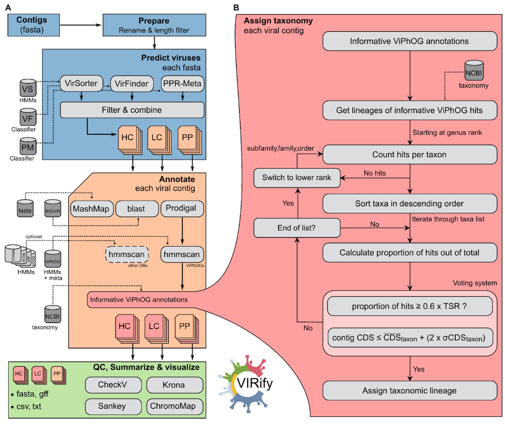

1. [ The VIRify pipeline ](#virify)
2. [ Pipeline overview ](#overview)
3. [ Usage ](docs/usage.md)
4. [ Output ](docs/output.md)
5. [ Detour: Metatranscriptomics ](docs/development.md#metatranscriptome)
6. [ Frequently Asked Questions (FAQ) ](docs/development.md#faq)
7. [ Technical Details ](docs/development.md#technical)
8. [ Citations ](#cite)

<a name="virify"></a>

# VIRify

## General
VIRify is a [Nextflow](https://www.nextflow.io/) pipeline for the detection, annotation, and taxonomic classification of viral contigs in metagenomic and metatranscriptomic assemblies. The pipeline is part of the repertoire of analysis services offered by [MGnify](https://www.ebi.ac.uk/metagenomics/). VIRify's taxonomic classification relies on the detection of taxon-specific profile hidden Markov models (HMMs), built upon a set of 22,013 orthologous protein domains and [referred to as ViPhOGs](https://doi.org/10.3390/v13061164).

<a name="overview"></a>

# Pipeline overview

For further details please check: [doi.org/10.1101/2022.08.22.504484](https://doi.org/10.1101/2022.08.22.504484)


## Requirements

- [Nextflow](https://www.nextflow.io/)
- [Docker](https://docs.docker.com/v17.09/engine/installation/linux/docker-ce/ubuntu/#install-docker-ce) or [Singularity](https://sylabs.io/guides/3.0/user-guide/quick_start.html)

**Attention**, the workflow will download the containers and databases with a size of roughly 19 GB (49 GB with `--hmmextend` and `--blastextend`) the first time it is executed!

## Input

The pipeline accepts assemblies via the `--samplesheet` parameter, a .csv file that can list as many assemblies as needed. Check the [Samplesheet](docs/usage.md#samplesheet) section before running the pipeline.

## Databases
All required databases are automatically downloaded by the pipeline when it is first run. Specify the `--databases` argument to define where databases should be downloaded. By default, databases are downloaded to `nextflow-autodownload-databases` folder. 

If the databases have already been downloaded, provide the existing directory using this argument instead. See the [Databases](docs/usage.md#databases) section for more information.

## Execution

Run annotation for a small assembly file (10 contigs, 0.78 Mbp) on your local Linux machine using Docker containers (per default `--cores 4`; takes approximately 10 min on a 8 core i7 laptop + time for database download; ~19 GB):

```bash
nextflow run EBI-Metagenomics/emg-viral-pipeline -r v3.0.0 \\
    --samplesheet samplesheet.csv \\
    --cores 4 -profile local,docker
```

See the [Execution](docs/usage.md#execution) and [Profiles](docs/usage.md#profiles) sections for further instructions, including how to resume a run, run on an HPC cluster (SLURM/LSF with Singularity), and switch execution profiles.

## Output

The outputs generated from viral prediction tools, ViPhOG annotation, taxonomy assign, and CheckV quality are integrated and summarized in a validated GFF file. See the [Output](docs/output.md) page for the full folder structure and file descriptions.

<a name="cite"></a>

# Cite

If you use the pipeline or ViPhOG HMMs in your work, please cite accordingly:

**ViPhOGs:**

[Moreno-Gallego, Jaime Leonardo, and Alejandro Reyes. "Informative regions in viral genomes." _Viruses_ 13.6 (2021): 1164.](https://www.mdpi.com/1999-4915/13/6/1164)

**VIRify:** 

[Rangel-Pineros, Guillermo, et al. "VIRify: an integrated detection, annotation and taxonomic classification pipeline using virus-specific protein profile hidden Markov models." _bioRxiv_ (2022)](https://doi.org/10.1101/2022.08.22.504484)
