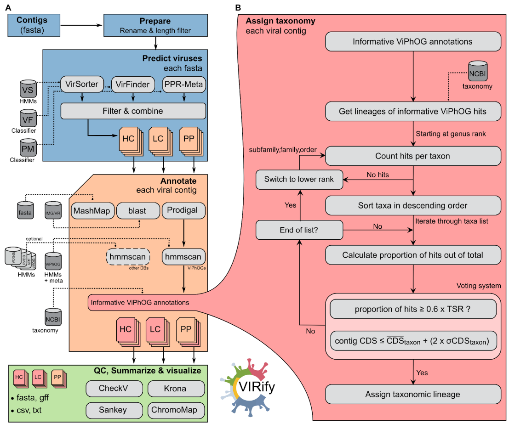

1. [ The VIRify pipeline ](#virify)
2. [ Nextflow execution ](#nf)
3. [ CWL execution (discontinued) ](#cwl)
4. [ Pipeline overview ](#overview)
5. [ Detour: Metatranscriptomics ](#metatranscriptome)
6. [ Resources ](#resources)
7. [ Citations ](#cite)

<a name="virify"></a>

# VIRify


## General
VIRify is a pipeline for the detection, annotation, and taxonomic classification of viral contigs in metagenomic and metatranscriptomic assemblies. The pipeline is part of the repertoire of analysis services offered by [MGnify](https://www.ebi.ac.uk/metagenomics/). VIRify's taxonomic classification relies on the detection of taxon-specific profile hidden Markov models (HMMs), built upon a set of 22,013 orthologous protein domains and [referred to as ViPhOGs](https://doi.org/10.3390/v13061164). 

The pipeline is implemented in [Nextflow](#nf) and additionally only Docker or Singularity are needed to run VIRify. Details about installation and usage are given below.

**Please note**, that until v1.0 the pipeline was also implemented in [CWL](#cwl) as an alternative to [Nextflow](#nf). However, later updates were only included in the [Nextflow](#nf) version of the pipeline. 


<a name="nf"></a>

# Nextflow

A [Nextflow](https://www.nextflow.io/) implementation of the VIRify pipeline. In the backend, the same scripts are used as in the [CWL](#cwl) implementation.

## What do I need?

This implementation of the pipeline runs with the workflow manager [Nextflow](https://www.nextflow.io/) and needs as second dependency either [Docker](https://docs.docker.com/v17.09/engine/installation/linux/docker-ce/ubuntu/#install-docker-ce) or [Singularity](https://sylabs.io/guides/3.0/user-guide/quick_start.html). Conda will be implemented soonish, hopefully (currently blocked bc/ we use [PPR-Meta](https://github.com/zhenchengfang/PPR-Meta/issues/8)). However, we highly recommend in any way the usage of the stable containers. All other programs and databases are automatically downloaded by Nextflow. 

**Attention**, the workflow will download the containers and databases with a size of roughly 19 GB (49 GB with `--hmmextend` and `--blastextend`) the first time it is executed! 

### Install Nextflow
```bash
curl -s https://get.nextflow.io | bash
```
* for troubleshooting, see [more instructions about Nextflow](https://www.nextflow.io/). 

### Install Docker
If you dont have experience with bioinformatic tools and their installation just copy the commands into your terminal to set everything up (local machine with full permissions!):
```bash
sudo apt-get install -y docker-ce docker-ce-cli containerd.io
sudo usermod -a -G docker $USER
```
* restart your computer
* for troubleshooting, see [more instructions about Docker](https://docs.docker.com/v17.09/engine/installation/linux/docker-ce/ubuntu/#install-docker-ce)

### Install Singularity

While singularity can be installed via Conda, we recommend setting up a _true_ Singularity installation. For HPCs, ask the system administrator you trust. [Here](https://github.com/hpcng/singularity/blob/master/INSTALL.md) is also a good manual to get you started. _Please note_: you only need Docker or Singularity. However, due to security concerns it might not be possible to use Docker on your shared machine or HPC.

## Basic Nextflow execution

### Install

While it is possible to clone this repository and directly execute the `virify.nf`, we _recommend_ to let Nextflow handle the installation. Get the pipeline code via:
```bash
nextflow pull EBI-Metagenomics/emg-viral-pipeline
```

Test installation and get help:
```bash
nextflow run EBI-Metagenomics/emg-viral-pipeline --help
```

### Run specific pipeline version

We __highly recommend__ to always run stable [releases](https://github.com/EBI-Metagenomics/emg-viral-pipeline/releases), also for reproducibility:
```bash
nextflow run EBI-Metagenomics/emg-viral-pipeline -r v0.4.0 --help
```

Check the [release page](https://github.com/EBI-Metagenomics/emg-viral-pipeline/releases) to figure out the newest version of the pipelne. Or run:

```bash
nextflow info EBI-Metagenomics/emg-viral-pipeline
```

### Example execution

Run annotation for a small assembly file (10 contigs, 0.78 Mbp) on your local Linux machine using Docker containers (per default `--cores 4`; takes approximately 10 min on a 8 core i7 laptop + time for database download; ~19 GB):
```bash
nextflow run EBI-Metagenomics/emg-viral-pipeline -r v0.4.0 --fasta "$HOME/.nextflow/assets/EBI-Metagenomics/emg-viral-pipeline/nextflow/test/assembly.fasta" --cores 4 -profile local,docker
```

__Please note__ that in particular the following parameters are important to handle where Nextflow writes files. 

* `--workdir` or `-w` (here your work directories with intermediate data will be saved)
* `--databases` (here your databases will be saved and the workflow checks if they are already available under this path)
* `--singularity_cachedir` (here Singularity containers will be cached, not needed for Docker, default path: `./singularity`)

**Please clean up your work directory from time to time to save disk space!**

## Profiles

Nextflow uses a merged profile handling system so you have to define an executor (e.g., `local`, `lsf`, `slurm`) and an engine (`docker`, `singularity`) to run the pipeline according to your needs and infrastructure. 

Per default, the workflow runs locally (e.g., on your laptop) with Docker. When you execute the workflow on a HPC you can for example switch to a specific job scheduler and Singularity instead of Docker:

* SLURM (``-profile slurm,singularity``)
* LSF (``-profile lsf,singularity``)

Don't forget, especially on an HPC, to define further important parameters such as `-w`, `--databases`, and `--singularity_cachedir` as mentioned above.

The engine `conda` is not working at the moment until there is a conda recipe for PPR-Meta or we switch the tool. Sorry. Use Docker. Or Singularity. Please. Or install PPR-Meta by yourself and then use the `conda` profile (not recommended).  

## Monitoring

 

To monitor your Nextflow computations, VIRify can be connected to [Nextflow Tower](https://tower.nf). You need a user access token to connect your Tower account with the pipeline. Simply [generate a login](https://tower.nf/login) using your email and then click the link sent to this address.

Once logged in, click on your avatar in the top right corner and select "Your tokens." Generate a token or copy the default one and set the following environment variable:

```bash
export TOWER_ACCESS_TOKEN=<YOUR_COPIED_TOKEN>
```

You can save this variable in your `.bashrc` or `.profile` to not need to enter it again. Refresh your terminal.

Now run:

```bash
nextflow run EBI-Metagenomics/emg-viral-pipeline -r v0.4.0 --fasta "$HOME/.nextflow/assets/EBI-Metagenomics/emg-viral-pipeline/nextflow/test/assembly.fasta" --cores 4 -profile local,docker -with-tower
```

Alternatively, you can also pull the code from this repository and activate the Tower connection within the `nextflow.config` file located in the root GitHub directory:

```java
tower {
    accessToken = ''
    enabled = true
} 
```

You can also directly enter your access token here instead of generating the above-mentioned environment variable.


### GFF output files

The outputs generated from viral prediction tools, ViPhOG annotation, taxonomy assign, and CheckV quality are integrated and summarized in a validated gff file. You can find such output in the `08-final/gff/` folder.

The labels used in the Type column of the gff file correspond to the following nomenclature according to the [Sequence Ontology resource](http://www.sequenceontology.org/browser/current_svn/term/SO:0000001):

| Type in gff file  | Sequence ontology ID |
| ------------- | ------------- |
| viral_sequence  | [SO:0001041](http://www.sequenceontology.org/browser/current_svn/term/SO:0001041) |
| prophage  | [SO:0001006](http://www.sequenceontology.org/browser/current_svn/term/SO:0001006) |
| CDS | [SO:0000316](http://www.sequenceontology.org/browser/current_svn/term/SO:0000316) |

Note that CDS are reported only when a ViPhOG match has been found. 


<a name="cwl"></a>

# Common Workflow Language (discontinued)

**Until VIRify v1.0**, VIRify was implemented in [Common Workflow Language (CWL)](https://www.commonwl.org/) next to the Nextflow implementation. Both Workflow Management Systems were previously supported. 

## What do I need?
The implementation until v1.0 of VIRify uses CWL version 1.2. It was tested using Toil version 5.3.0 as the workflow engine and conda to manage the software dependencies.

## How?
For instructions go to the [CWL README](cwl/README.md).


<a name="overview"></a>

# Pipeline overview

For further details please check: [doi.org/10.1101/2022.08.22.504484](https://doi.org/10.1101/2022.08.22.504484)


<a name="metatranscriptome"></a>

# A note about metatranscriptomes

Although VIRify has been benchmarked and validated with metagenomic data in mind, it is also possible to use this tool to detect RNA viruses in metatranscriptome assemblies (e.g. SARS-CoV-2). However, some additional considerations for this purpose are outlined below:

**1. Quality control:** As for metagenomic data, a thorough quality control of the FASTQ sequence reads to remove low-quality bases, adapters and host contamination (if appropriate) is required prior to assembly. This is especially important for metatranscriptomes as small errors can further decrease the quality and contiguity of the assembly obtained. We have used [TrimGalore](https://www.bioinformatics.babraham.ac.uk/projects/trim_galore/) for this purpose.

**2. Assembly:** There are many assemblers available that are appropriate for either metagenomic or single-species transcriptomic data. However, to our knowledge, there is no assembler currently available specifically for metatranscriptomic data. From our preliminary investigations, we have found that transcriptome-specific assemblers (e.g. [rnaSPAdes](http://cab.spbu.ru/software/spades/)) generate more contiguous and complete metatranscriptome assemblies compared to metagenomic alternatives (e.g. [MEGAHIT](https://github.com/voutcn/megahit/releases) and [metaSPAdes](http://cab.spbu.ru/software/spades/)).

**3. Post-processing:** Metatranscriptomes generate highly fragmented assemblies. Therefore, filtering contigs based on a set minimum length has a substantial impact in the number of contigs processed in VIRify. It has also been observed that the number of false-positive detections of [VirFinder](https://github.com/jessieren/VirFinder/releases) (one of the tools included in VIRify) is lower among larger contigs. The choice of a length threshold will depend on the complexity of the sample and the sequencing technology used, but in our experience any contigs <2 kb should be analysed with caution.

**4. Classification:** The classification module of VIRify depends on the presence of a minimum number and proportion of phylogenetically-informative genes within each contig in order to confidently assign a taxonomic lineage. Therefore, short contigs typically obtained from metatranscriptome assemblies remain generally unclassified. For targeted classification of RNA viruses (for instance, to search for Coronavirus-related sequences), alternative DNA- or protein-based classification methods can be used. Two of the possible options are: (i) using [MashMap](https://github.com/marbl/MashMap/releases) to screen the VIRify contigs against a database of RNA viruses (e.g. Coronaviridae) or (ii) using [hmmsearch](http://hmmer.org/download.html) to screen the proteins obtained in the VIRify contigs against marker genes of the taxon of interest.

<a name="resources"></a>

# Resources

Additional material (assemblies used for benchmarking in the paper, ...) as well as the ViPhOG HMMs with model-specific bit score thresholds used in VIRify are available at [osf.io/fbrxy](https://osf.io/fbrxy/).

Here, we also list databases used and automatically downloaded by the pipeline **(in v2.0.0)** when it is first run. We deposited database files on a separate FTP to ensure their accessibility. The files can be also downloaded manually and then used as an input for the pipeline to prevent the auto-download (see `--help` in the Nextflow pipeline).

### Virus-specific protein profile HMMs

* **ViPhOGs** (mandatory, used for taxonomy assignment)
    * `wget -nH ftp://ftp.ebi.ac.uk/pub/databases/metagenomics/viral-pipeline/hmmer_databases/vpHMM_database_v3.tar.gz`
    * Additional metadata file for filtering the ViPhOGs (according to taxonomy updates by the [ICTV](https://ictv.global/taxonomy))
        * `wget ftp://ftp.ebi.ac.uk/pub/databases/metagenomics/viral-pipeline/additional_data_vpHMMs_v4.tsv`
    * [Publication](https://www.mdpi.com/1999-4915/13/6/1164)
* **pVOGs** (optional)
    * `wget -nH ftp://ftp.ebi.ac.uk/pub/databases/metagenomics/viral-pipeline/hmmer_databases/pvogs.tar.gz`
    * [Publication](https://doi.org/10.1093/nar/gkw975)
* **RVDB** (optional)
    * `wget -nH ftp://ftp.ebi.ac.uk/pub/databases/metagenomics/viral-pipeline/hmmer_databases/rvdb.tar.gz`
    * [Publication](https://www.ncbi.nlm.nih.gov/pmc/articles/PMC7492780/)
* **VOGDB** (optional)
    * `wget -nH ftp://ftp.ebi.ac.uk/pub/databases/metagenomics/viral-pipeline/hmmer_databases/vogdb.tar.gz`
    * [Publication](https://vogdb.org/)
* **VPF** (optional)
    * `wget -nH ftp://ftp.ebi.ac.uk/pub/databases/metagenomics/viral-pipeline/hmmer_databases/vpf.tar.gz`
    * [Publication](https://doi.org/10.1093/nar/gky1127)

### Initial virus prediction on contig level

* **VirSorter** HMMs
    * `wget ftp://ftp.ebi.ac.uk/pub/databases/metagenomics/viral-pipeline/virsorter-data-v2.tar.gz`
    * [Publication](https://peerj.com/articles/985/)
* **Virfinder** model
    * `wget ftp://ftp.ebi.ac.uk/pub/databases/metagenomics/viral-pipeline/virfinder/VF.modEPV_k8.rda`
    * [Publication](https://microbiomejournal.biomedcentral.com/articles/10.1186/s40168-017-0283-5)

### Virus prediction QC

* **CheckV**
    * `wget https://portal.nersc.gov/CheckV/checkv-db-v1.0.tar.gz`
    * [Publication](https://www.nature.com/articles/s41587-020-00774-7)

### Taxonomy annotation

* **NCBI taxonomy**
    * `wget -nH ftp://ftp.ebi.ac.uk/pub/databases/metagenomics/viral-pipeline/2022-11-01_ete3_ncbi_tax.sqlite.gz`

### Additional blast-based assignment (optional, super slow)

* **IMG/VR**
    * `wget -nH ftp://ftp.ebi.ac.uk/pub/databases/metagenomics/viral-pipeline/IMG_VR_2018-07-01_4.tar.gz`
    * [Publication](https://doi.org/10.1093/nar/gkw1030)


<a name="cite"></a>

# Cite

If you use the pipeline or ViPhOG HMMs in your work, please cite accordingly:

**ViPhOGs:**

[Moreno-Gallego, Jaime Leonardo, and Alejandro Reyes. "Informative regions in viral genomes." _Viruses_ 13.6 (2021): 1164.](https://www.mdpi.com/1999-4915/13/6/1164)

**VIRify:** 

[Rangel-Pineros, Guillermo, et al. "VIRify: an integrated detection, annotation and taxonomic classification pipeline using virus-specific protein profile hidden Markov models." _bioRxiv_ (2022)](https://doi.org/10.1101/2022.08.22.504484)
