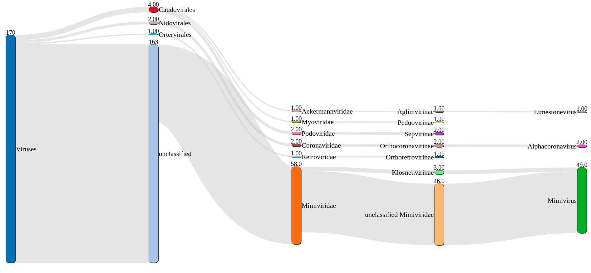
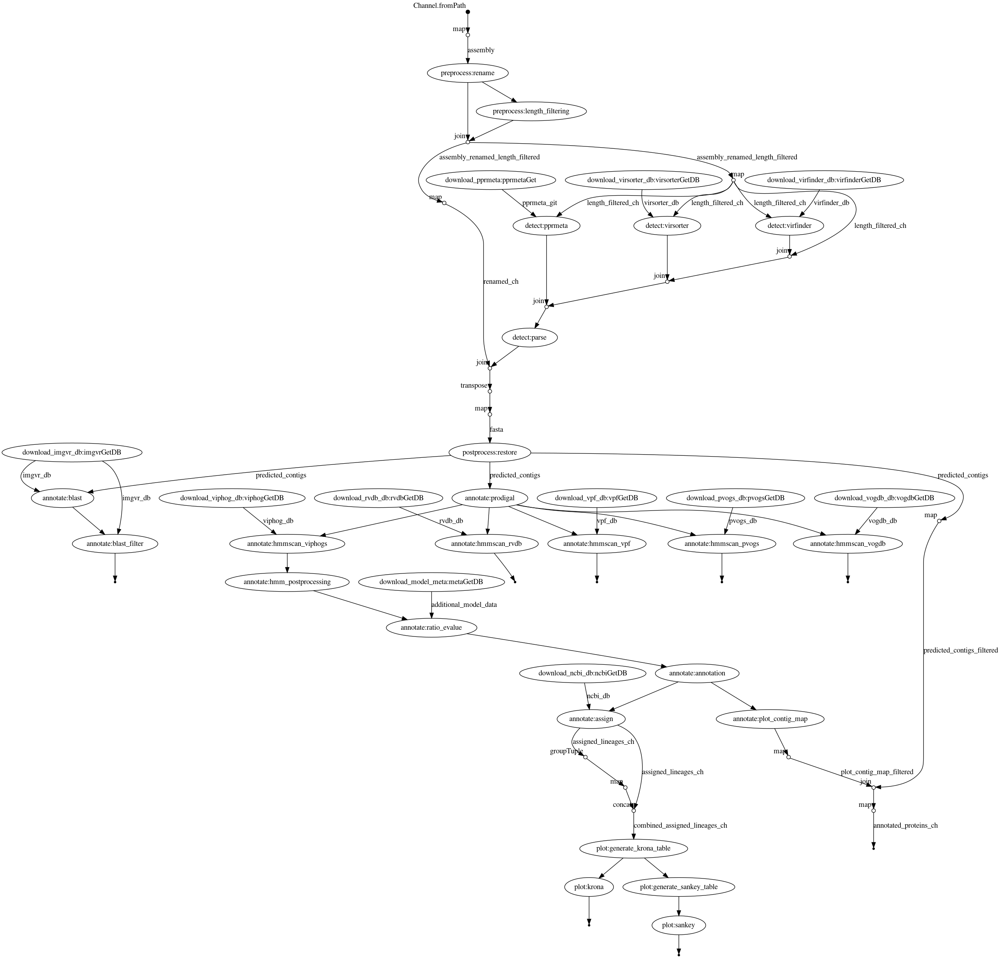

1. [ VIRify pipeline ](#virify)
2. [ CWL execution ](#cwl)
3. [ Nextflow execution ](#nf)

<a name="virify"></a>

# VIRify

VIRify is a recently developed pipeline for the detection, annotation, and taxonomic classification of viral contigs in metagenomic and metatranscriptomic assemblies. The pipeline is part of the repertoire of analysis services offered by [MGnify](https://www.ebi.ac.uk/metagenomics/). VIRify’s taxonomic classification relies on the detection of taxon-specific profile hidden Markov models (HMMs), built upon a set of 22,014 orthologous protein domains and referred to as ViPhOGs. 

## Metatranscriptomics

TODO ... Alex? 

<a name="cwl"></a>

# CWL

TODO ...

<a name="nf"></a>

# Nextflow
Email: hoelzer.martin@gmail.com

A nextflow implementation of the VIRify pipeline for the detection of viruses from metagenomic assemblies. The same scripts are used in the CWL and Nextflow implementation. 

## What do I need?

This pipeline runs with the workflow manager [Nextflow](https://www.nextflow.io/) using [Docker](https://docs.docker.com/v17.09/engine/installation/linux/docker-ce/ubuntu/#install-docker-ce) (Conda will be implemented soonish, hopefully). All other programs and databases are automatically downloaded by Nextflow. _Attention_, the workflow will download databases with a size of roughly 49 GB the first time it is executed. 

### Install Nextflow
```bash
curl -s https://get.nextflow.io | bash
```
* see [more instructions about Nextflow](https://www.nextflow.io/). 

### Install Docker
If you dont have experience with bioinformatic tools and their installation just copy the commands into your terminal to set everything up:
```bash
sudo apt-get install -y docker-ce docker-ce-cli containerd.io
sudo usermod -a -G docker $USER
```
* restart your computer
* see [more instructions about Docker](https://docs.docker.com/v17.09/engine/installation/linux/docker-ce/ubuntu/#install-docker-ce)


## Basic execution

Simply clone this repository or get or update the workflow via Nextflow:
```bash
nextflow pull EBI-Metagenomics/emg-viral-pipeline
```

Get help:
```bash
nextflow run EBI-Metagenomics/emg-viral-pipeline --help
```

Run annotation for a small assembly file (takes approximately 30min + time for database download; ~49 GB):
````
nextflow run EBI-Metagenomics/emg-viral-pipeline --fasta '~/.nextflow/assets/EBI-Metagenomics/emg-viral-pipeline/test/assembly.fasta'
````

## Profiles

Per default, the workflow is run with Docker-support. When you execute the workflow on a HPC you can switch to 
* SLURM (``-profile slurm``)
* LSF (``-profile lsf``)
and then you should also define the parameters
* `--workdir` (here your work directories will be save)
* `--databases` (here your databases will be saved and the workflow checks if they are already available)
* `--cachedir` (here Docker/Singularity containers will be cached)

The `-profile conda` is not working at the moment until there is a conda recipe for PPR-Meta. Sorry. Use Docker. Please. 

## DAG chart



