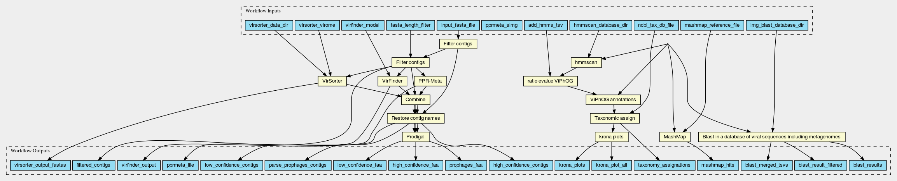

# CWL viral pipeline

CWL implementation of the MGnify viral pipeline.

## Setup

Install [conda](https://docs.conda.io/en/latest/) and create an env using the `conda_env.yml` file:

**Rename the path in requirements/conda_env.yml to the desired env path**

```bash
conda env create -f requirements/conda_env.yml
```

The `init.sh` file is meant to set some env variables needed for the execution, this script is called from `virify.sh`.

### Databases

In order to run the pipeline the following databases are required:

Everything is packed and ready to be used from EBI FTP:

```bash
rsync -av --progress rsync://rsync.ebi.ac.uk/pub/databases/metagenomics/viral-pipeline/ databases/
```

## Running full pipeline from CLI

The pipeline users [toil](https://github.com/DataBiosphere/toil) as the CWL execution engine.

In order to run it use the helper script (provided you adjusted the paths on it).

```bash
$ ./virify.sh -h
```

## Structure of pipeline



# Tests

CWL tests are executed with [cwltest](https://github.com/common-workflow-language/cwltest).

Run:
```bash
cd tests
./cwltest.sh
```