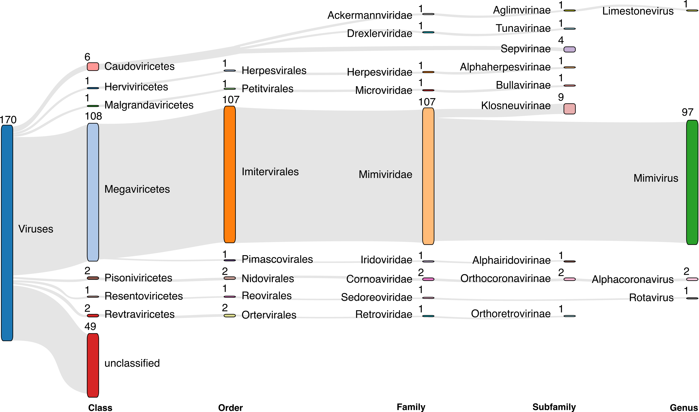

# Output

## Table of contents

- [Results](#results)
- [GFF output files](#gff-output-files)

## Results

The outputs generated from viral prediction tools, ViPhOG annotation, taxonomy assign, and CheckV quality are integrated and summarized in a validated gff file.
By default pipeline produces `08-final` folder with the following structure:

Structure example per-assembly

    not_matched_proteins_report.tsv

    08-final
        ├── annotation
        │   ├── hmmer
        │   │   ├── high_confidence_viral_contigs_split_annotation.tsv
        │   │   ├── low_confidence_viral_contigs_split_annotation.tsv
        │   │   └── prophages_split_annotation.tsv
        │   └── plot_contig_map
        │       ├── high_confidence_viral_contigs_mapping_results
        │       │   ├── high_confidence_viral_contigs_prot_ann_table_filtered.tsv
        │       │   └── plot_pdfs.tar.gz
        │       ├── low_confidence_viral_contigs_mapping_results
        │       │   ├── low_confidence_viral_contigs_prot_ann_table_filtered.tsv
        │       │   └── plot_pdfs.tar.gz
        │       └── prophages_mapping_results
        │           ├── plot_pdfs.tar.gz
        │           └── prophages_prot_ann_table_filtered.tsv
        ├── contigs
        │   ├── ACCESSION_map.tsv
        │   ├── ACCESSION_renamed_original.fasta
        │   ├── high_confidence_viral_contigs_original.fasta
        │   ├── low_confidence_viral_contigs_original.fasta
        │   └── prophages_original.fasta
        ├── chromomap [optional step]
        ├── gff
        │   ├── ACCESSION_virify.gff.gz
        │   ├── ACCESSION_virify.gff.gz.csi
        │   └── ACCESSION_virify.gff.gz.gzi
        ├── krona
        │   ├── ACCESSION.all.krona.html
        │   ├── high_confidence_viral_contigs.krona.html
        │   ├── low_confidence_viral_contigs.krona.html
        │   └── prophages.krona.html
        └── sankey
            ├── ACCESSION.all.sankey.html
            ├── high_confidence_viral_contigs.sankey.html
            ├── low_confidence_viral_contigs.sankey.html
            └── prophages.sankey.html

In order to have expanded output with more files use `--publish_all` option in pipeline execution.

Expanded structure example per-assembly

    not_matched_proteins_report.tsv

    ├── 01-predictions
    │   ├── ACCESSION_virus_predictions.stats
    │   ├── pprmeta
    │   │   └── ACCESSION*pprmeta.csv
    │   ├── virfinder
    │   │   └── ACCESSION*.txt
    │   └── virsorter2
    │       ├── final-viral-boundary.tsv
    │       ├── final-viral-combined.fa
    │       ├── final-viral-score.tsv
    │       └── virsorter_metadata.tsv
    ├── 02-protein-prediction [if proteins_faa and proteins_gff were not provided as input]
    │   ├── ACCESSION.faa.gz
    │   └── ACCESSION.gff.gz
    │   └── ACCESSION.fna.gz
    ├── 03-hmmer
    │   ├── high_confidence_viral_contigs_modified.tsv
    │   ├── low_confidence_viral_contigs_modified.tsv
    │   ├── prophages_modified.tsv
    │   ├── ratio_evalue_tables
    │   │   ├── high_confidence_viral_contigs_modified_informative.tsv
    │   │   ├── low_confidence_viral_contigs_modified_informative.tsv
    │   │   └── prophages_modified_informative.tsv
    │   └── vpHMM_database_v3
    │       ├── high_confidence_viral_contigs*_vpHMM_database_v3_hmmsearch.tbl
    │       ├── low_confidence_viral_contigs*_vpHMM_database_v3_hmmsearch.tbl
    │       └── prophages*_vpHMM_database_v3_hmmsearch.tbl
    │   └── [other chosen optional HMM DBs]
    ├── 04-blast [optional step]
    ├── 05-plots
    │   ├── krona
    │   │   ├── ACCESSION.counts.tsv
    │   │   ├── high_confidence_viral_contigs.counts.tsv
    │   │   ├── low_confidence_viral_contigs.counts.tsv
    │   │   └── prophages.counts.tsv
    │   └── sankey
    │       ├── all.sankey.filtered-25.json
    │       ├── all.sankey.tsv
    │       ├── high_confidence_viral_contigs.sankey.filtered-25.json
    │       ├── high_confidence_viral_contigs.sankey.tsv
    │       ├── low_confidence_viral_contigs.sankey.filtered-25.json
    │       ├── low_confidence_viral_contigs.sankey.tsv
    │       ├── prophages.sankey.filtered-25.json
    │       └── prophages.sankey.tsv
    ├── 06-taxonomy
    │   ├── high_confidence_viral_contigs_prodigal_annotation_taxonomy.tsv
    │   ├── low_confidence_viral_contigs_prodigal_annotation_taxonomy.tsv
    │   └── prophages_prodigal_annotation_taxonomy.tsv
    ├── 07-checkv
    │   ├── high_confidence_viral_contigs_quality_summary.tsv
    │   ├── low_confidence_viral_contigs_quality_summary.tsv
    │   └── prophages_quality_summary.tsv
    └── 08-final
        ├── annotation
        │   ├── hmmer
        │   │   ├── high_confidence_viral_contigs_*_annotation.tsv
        │   │   ├── low_confidence_viral_contigs_*_annotation.tsv
        │   │   └── prophages_*_annotation.tsv
        │   └── plot_contig_map
        │       ├── high_confidence_viral_contigs_mapping_results
        │       │   ├── high_confidence_viral_contigs_prot_ann_table_filtered.tsv
        │       │   └── plot_pdfs.tar.gz
        │       ├── low_confidence_viral_contigs_mapping_results
        │       │   ├── low_confidence_viral_contigs_prot_ann_table_filtered.tsv
        │       │   └── plot_pdfs.tar.gz
        │       └── prophages_mapping_results
        │           ├── plot_pdfs.tar.gz
        │           └── prophages_prot_ann_table_filtered.tsv
        ├── contigs
        │   ├── ACCESSION_map.tsv
        │   ├── ACCESSION_renamed_original.fasta
        │   ├── high_confidence_viral_contigs_original.fasta
        │   ├── low_confidence_viral_contigs_original.fasta
        │   └── prophages_original.fasta
        ├── chromomap [optional step]
        ├── gff
        │   ├── ACCESSION_virify.gff.gz
        │   ├── ACCESSION_virify.gff.gz.csi
        │   └── ACCESSION_virify.gff.gz.gzi
        ├── krona
        │   ├── ACCESSION.all.krona.html
        │   ├── high_confidence_viral_contigs.krona.html
        │   ├── low_confidence_viral_contigs.krona.html
        │   └── prophages.krona.html
        └── sankey
            ├── ACCESSION.all.sankey.html
            ├── high_confidence_viral_contigs.sankey.html
            ├── low_confidence_viral_contigs.sankey.html
            └── prophages.sankey.html

### GFF output files

You can find such output in the `08-final/gff/` folder.

The labels used in the Type column of the gff file correspond to the following nomenclature according to the [Sequence Ontology resource](http://www.sequenceontology.org/browser/current_svn/term/SO:0000001):

| Type in gff file  | Sequence ontology ID |
| ------------- | ------------- |
| viral_sequence  | [SO:0001041](http://www.sequenceontology.org/browser/current_svn/term/SO:0001041) |
| prophage  | [SO:0001006](http://www.sequenceontology.org/browser/current_svn/term/SO:0001006) |
| CDS | [SO:0000316](http://www.sequenceontology.org/browser/current_svn/term/SO:0000316) |

Note that CDS are reported only when a ViPhOG match has been found.
