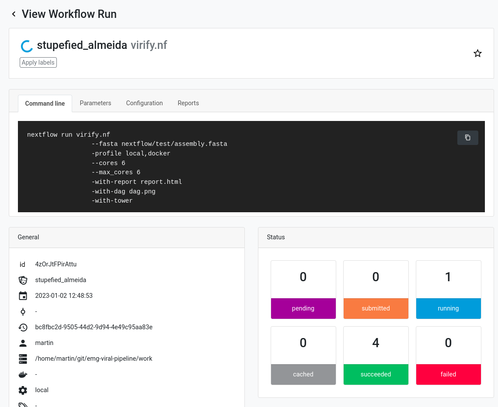

# Usage

## Table of contents

- [Samplesheet](#samplesheet)
- [Databases](#databases)
- [Execution](#execution)
- [Profiles](#profiles)
- [Monitoring](#monitoring)

## Samplesheet

The samplesheet must be a `.csv` file that contains the following columns:

- `id` - Sample identifier (mandatory)
- `assembly` - Assembly file in FASTA format (mandatory)
- `proteins_gff` - Proteins file in GFF3 format (optional)
- `proteins_faa` - Proteins file in FASTA format (optional)

The `proteins_gff` and `proteins_faa` files are optional and, if both provided, allow the pipeline to skip calling the protein caller (Prodigal) again.
> [!NOTE]
> The pipeline was tested on `FAA` and `GFF` from the following tools:
> - Prodigal
> - Pyrodigal
> - Prokka
> - FragGeneScan
>
> Important: headers from `FAA` fasta should match `ID=` in the `GFF attributes` column.

[Example](../assets/example_input.csv)
```
id,assembly,proteins_gff,proteins_faa
my_favourite_assembly,ERZ123.fasta,,
```


## Databases

We deposited database files on a separate FTP to ensure their accessibility. Each database is fetched from the URL in the table below, which can be overridden independently via its "Download link argument" (e.g. `--viphog_download_link`), in case you need to point at a mirror or a different version. The link is only used when the corresponding "Input argument" path is not already provided, so you can also download a database manually and pass it in directly to prevent the auto-download (see `--help` in the Nextflow pipeline).
All fetched databases would be saved to folder regulated by `--databases` argument (default: `nextflow-autodownload-databases`).

Additional material (assemblies used for benchmarking in the paper, ...) as well as the ViPhOG HMMs with model-specific bit score thresholds used in VIRify are available at [osf.io/fbrxy](https://osf.io/fbrxy/).

#### Virus-specific protein profile HMMs

| Database | Notes | Input argument | Download link argument | Link | Publication |
|----------|-------|-----------------|-------------------------|------|-------------|
| ViPhOGs | mandatory, used for taxonomy assignment | `--viphog` | `--viphog_download_link` | ftp://ftp.ebi.ac.uk/pub/databases/metagenomics/viral-pipeline/hmmer_databases/vpHMM_database_{VERSION}.tar.gz | https://www.mdpi.com/1999-4915/13/6/1164 |
| ViPhOG metadata | mandatory, metadata for filtering ViPhOGs according to taxonomy updates by the [ICTV](https://ictv.global/taxonomy) | `--meta` | `--meta_download_link` | ftp://ftp.ebi.ac.uk/pub/databases/metagenomics/viral-pipeline/additional_data_vpHMMs_{VERSION}.tsv | - |
| pVOGs | optional, `--hmmextend` | `--pvogs` | `--pvogs_download_link` | ftp://ftp.ebi.ac.uk/pub/databases/metagenomics/viral-pipeline/hmmer_databases/pvogs.tar.gz | https://doi.org/10.1093/nar/gkw975 |
| RVDB | optional, `--hmmextend` | `--rvdb` | `--rvdb_download_link` | ftp://ftp.ebi.ac.uk/pub/databases/metagenomics/viral-pipeline/hmmer_databases/rvdb.tar.gz | https://www.ncbi.nlm.nih.gov/pmc/articles/PMC7492780/ |
| VOGDB | optional, `--hmmextend` | `--vogdb` | `--vogdb_download_link` | ftp://ftp.ebi.ac.uk/pub/databases/metagenomics/viral-pipeline/hmmer_databases/vogdb.tar.gz | https://vogdb.org/ |
| VPF | optional, `--hmmextend` | `--vpf` | `--vpf_download_link` | ftp://ftp.ebi.ac.uk/pub/databases/metagenomics/viral-pipeline/hmmer_databases/vpf.tar.gz | https://doi.org/10.1093/nar/gky1127 |

#### Initial virus prediction on contig level

| Database | Notes | Input argument | Download link argument | Link | Publication |
|----------|-------|-----------------|-------------------------|------|-------------|
| VirSorter2 | default, used unless `--use_virsorter_v1` is set | `--virsorter2` | `--virsorter2_download_link` | https://osf.io/v46sc/download | https://doi.org/10.1186/s40168-020-00990-y |
| VirSorter (v1) | used with `--use_virsorter_v1` | `--virsorter` | `--virsorter_download_link` | ftp://ftp.ebi.ac.uk/pub/databases/metagenomics/viral-pipeline/virsorter-data-v2.tar.gz | https://peerj.com/articles/985/ |
| VirFinder | mandatory | `--virfinder` | `--virfinder_download_link` | ftp://ftp.ebi.ac.uk/pub/databases/metagenomics/viral-pipeline/virfinder/VF.modEPV_k8.rda | https://microbiomejournal.biomedcentral.com/articles/10.1186/s40168-017-0283-5 |
| PPR-Meta | mandatory | `--pprmeta` | `--pprmeta_download_link` | https://github.com/zhenchengfang/PPR-Meta/archive/refs/tags/v1.1.tar.gz | https://doi.org/10.1093/gigascience/giaa112 |

#### Virus prediction QC

| Database | Notes | Input argument | Download link argument | Link | Publication |
|----------|-------|-----------------|-------------------------|------|-------------|
| CheckV | mandatory | `--checkv` | `--checkv_download_link` | https://portal.nersc.gov/CheckV/checkv-db-v1.5.tar.gz | https://www.nature.com/articles/s41587-020-00774-7 |

#### Taxonomy annotation

| Database | Notes | Input argument | Download link argument | Link | Publication |
|----------|-------|-----------------|-------------------------|------|-------------|
| NCBI taxonomy | mandatory | `--ncbi` | `--ncbi_download_link` | ftp://ftp.ebi.ac.uk/pub/databases/metagenomics/viral-pipeline/2022-11-01_ete3_ncbi_tax.sqlite.gz | - |

#### Additional blast-based assignment (optional, super slow)

| Database | Notes | Input argument | Download link argument | Link | Publication |
|----------|-------|-----------------|-------------------------|------|-------------|
| IMG/VR | optional, `--blastextend` | `--imgvr` | `--imgvr_download_link` | ftp://ftp.ebi.ac.uk/pub/databases/metagenomics/viral-pipeline/IMG_VR_2018-07-01_4.tar.gz | https://doi.org/10.1093/nar/gkw1030 |


## Execution

Run annotation for a small assembly file (10 contigs, 0.78 Mbp) on your local Linux machine using Docker containers (per default `--cores 4`; takes approximately 10 min on a 8 core i7 laptop + time for database download; ~19 GB):

**Please clean up your work directory from time to time to save disk space!**

### Useful runtime flags

* `--hmmextend` - run additional HMM databases (pVOGs, RVDB, VOGDB, VPF) for more annotation hits.
* `--blastextend` - run the additional BLAST-based comparison against IMG/VR (slow).
* `--publish_all` - publish the expanded, per-step output folder structure (see [Output](output.md)) instead of just `08-final`.
* `--output <dir>` - change the name/location of the results folder (default: `results`).

## Profiles

Nextflow uses a merged profile handling system so you have to define an executor (e.g., `local`, `lsf`, `slurm`) and an engine (e.g., `docker`, `singularity`) to run the pipeline according to your needs and infrastructure. Per default, the workflow runs locally (e.g., on your laptop) with Docker.

The engine `conda` is not working at the moment until there is a conda recipe for PPR-Meta or we switch the tool. Sorry. Use Docker. Or Singularity. Please. Or install PPR-Meta by yourself and then use the `conda` profile (not recommended).


### Example of execution command
```bash
nextflow run EBI-Metagenomics/emg-viral-pipeline -r v4.0.0 \
    --samplesheet samplesheet.csv \
    --cores 4 \
    -profile local,docker \
    -resume
```

## Monitoring



To monitor your Nextflow computations, VIRify can be connected to [Nextflow Tower](https://tower.nf). You need a user access token to connect your Tower account with the pipeline. Simply [generate a login](https://tower.nf/login) using your email and then click the link sent to this address.

Once logged in, click on your avatar in the top right corner and select "Your tokens." Generate a token or copy the default one and set the following environment variable:

```bash
export TOWER_ACCESS_TOKEN=<YOUR_COPIED_TOKEN>
```

You can save this variable in your `.bashrc` or `.profile` to not need to enter it again. Refresh your terminal.

Now run:

```bash
nextflow run EBI-Metagenomics/emg-viral-pipeline -r v0.4.0 \
    --samplesheet samplesheet.csv \
    --cores 4 -profile local,docker \
    -with-tower
```

Alternatively, you can also pull the code from this repository and activate the Tower connection within the `nextflow.config` file located in the root GitHub directory:

```java
tower {
    accessToken = ''
    enabled = true
}
```

You can also directly enter your access token here instead of generating the above-mentioned environment variable.
